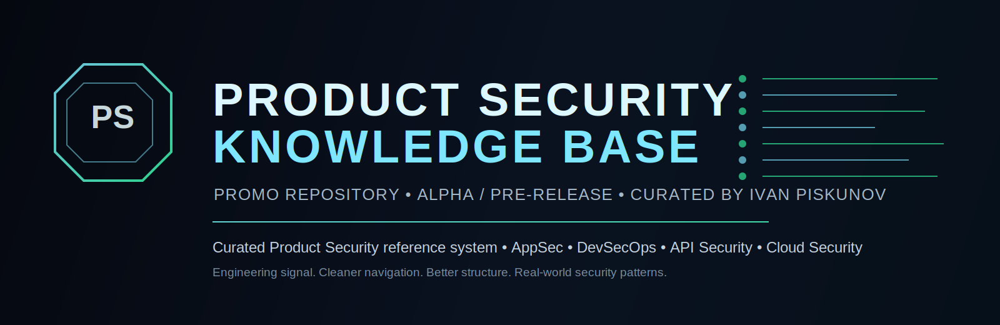

  

  
  
  
  

  
  
  

---

## Product Security Knowledge Base

**Product Security Knowledge Base** is a curated, practitioner-driven reference system for modern software security.

It is being built as a structured, long-horizon body of work across **Product Security, Application Security, DevSecOps, API Security, Cloud Security, Secure SDLC, Threat Modeling, architecture review, engineering enablement, and leadership operating models**.

This repository is the **presentation layer** of the project: a premium GitHub-facing overview that explains the mission, the author, the roots of the work, and the evolution from early articles and books into a broader Product Security knowledge system.

  

## Why this exists

The goal is not to publish another chaotic archive of links.

The goal is to build a **clear, usable, high-signal reference library** that helps:

- security engineers strengthen technical depth;
- platform, cloud, and application teams adopt safer engineering practices;
- new practitioners ramp up faster with less noise;
- security leaders frame operating models, priorities, metrics, and narrative;
- ambitious engineers improve real-world readiness and earn stronger opportunities.

This project is intentionally designed around **systematization, clarity, practical value, and defensive engineering discipline**.

  

## About the author

**Ivan Piskunov** is a cybersecurity specialist and Product Security practitioner with a background spanning **fintech-oriented software environments, AppSec, DevSecOps, Cloud Security, Security Champion work, and later Product Security leadership positioning**.

For **more than 7 years**, he has been consistently building around Product Security and adjacent domains — first through technical articles, then books and structured notes, then community education, and now through a full Product Security knowledge platform.

His work is centered on:

- turning fragmented security knowledge into structured systems;
- translating hard technical material into usable engineering guidance;
- mentoring younger engineers on practical skills and industry navigation;
- helping practitioners sharpen hard skills and move toward stronger roles and offers;
- positioning modern Product Security as both a technical and business-enabling function.

He positions himself toward **Product Security Director / VP-level scope**, with a strong emphasis on execution, architecture, enablement, and long-term program design.

➡️ Read more: [About the Author](docs/ABOUT-THE-AUTHOR.md)

  

## From articles to a knowledge system

The Knowledge Base did not appear overnight.

It grew in layers:

1. **Technical writing and public articles**
2. **Books / note collections / long-form practical materials**
3. **Community publishing and education**
4. **Reusable repositories, checklists, scripts, and reference packs**
5. **Leadership framing around Product Security**
6. **A dedicated structured knowledge base with domain navigation**

That progression matters because the project is rooted in real publishing, engineering practice, and repeated knowledge distillation — not just branding.

➡️ See the full story: [Origins and Timeline](docs/ORIGINS-AND-TIMELINE.md)  
➡️ Browse the source trail: [Prior Works](docs/PRIOR-WORKS.md)

  

## Coverage map

The alpha structure of the Knowledge Base already points to a wide Product Security surface, including:

| Domain | Focus |
|---|---|
| Product Security Leadership | governance, roles, metrics, OKRs, operating models |
| Application Security | review playbooks, SAST, secrets, testing, mobile |
| API Security | authz, abuse resilience, API design and assessment |
| DevSecOps | CI/CD controls, guardrails, supply chain, evidence |
| Cloud Security | IAM, baseline controls, Terraform, platform hardening |
| Container & Kubernetes Security | runtime, hardening, cluster review, controls |
| Threat Modeling | practical modeling, architecture decision support |
| Frontend & Browser Security | sessions, CSP, OAuth/browser patterns |
| Secure SDLC | integration into delivery and engineering workflows |
| Learning & Career Growth | newcomer tracks, labs, mentoring paths |

➡️ Explore more: [Domain Map](docs/DOMAIN-MAP.md)

  

## Beta readers and early feedback loop

Before the final public release, the project includes a **small beta group program** for early readers and reviewers.

The idea is simple: invite a focused group of **20–30 beta participants** to explore parts of the material, stress-test structure and clarity, and provide practical feedback that improves the final release.

This makes the project more useful, more honest, and closer to what real engineers actually need.

➡️ Details: [Beta Program](docs/BETA-PROGRAM.md)

  

## Navigation

### Core pages

- [About the Author](docs/ABOUT-THE-AUTHOR.md)
- [Origins and Timeline](docs/ORIGINS-AND-TIMELINE.md)
- [Prior Works and Public Trail](docs/PRIOR-WORKS.md)
- [Domain Map](docs/DOMAIN-MAP.md)
- [Beta Program](docs/BETA-PROGRAM.md)
- [Roadmap](docs/ROADMAP.md)
- [FAQ](docs/FAQ.md)
- [Links](docs/LINKS.md)

### Project files

- [Changelog](CHANGELOG.md)
- [Contributing](CONTRIBUTING.md)
- [Security Policy](SECURITY.md)
- [License](LICENSE.md)

  

## Public roots of this project

Some of the public works that fed into this Knowledge Base include:

- **DevSecOps Notes Box** — long-form practical notes and reference material
- **White2Hack** — a long-running cybersecurity Telegram/community publishing lane
- **CyberSecBastion** — a dedicated Product Security-oriented side channel in the ecosystem
- **K8-Shield** — a Kubernetes security utility / audit direction
- **Product-Security-Manager** — Product Security framing and leadership materials
- **Docs_DevSecOps_Vault** — reusable documents, checklists, guides, and technical patterns
- **Medium / DEV / Hacker Magazine** — public articles that predate and support the broader KB

➡️ Full reference map: [Prior Works](docs/PRIOR-WORKS.md)

  

## Design notes

This repository is intentionally styled as a **clean, premium, hacker-adjacent GitHub presentation repo**:

- dark, technical visual language;
- sharp information hierarchy;
- linked multi-page navigation;
- concise but high-signal prose;
- reusable visual assets for banners, separators, and section rhythm.

The actual Knowledge Base remains the deeper system.  
This repository is the **front door**.

---

  
    Product Security Knowledge Base • created and curated by Ivan Piskunov • premium GitHub promo repository • 2026
  

