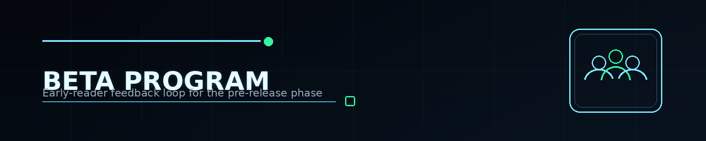

  

# Beta Program

Before the final release, the Knowledge Base includes an early feedback track with a **small beta group**.

## Purpose

The purpose of the beta group is to improve the final release through real reader feedback.

Instead of publishing a polished-looking but untested archive, this project uses an early signal loop to validate:

- clarity of structure;
- quality of navigation;
- usefulness of explanations;
- practical value for engineers;
- readability and flow;
- what should be expanded, merged, simplified, or removed.

## Planned group size

The target beta group is intentionally small and focused:

**20–30 participants**

This size is large enough to surface patterns, but still small enough to keep feedback thoughtful and actionable.

## Who the beta group is for

The beta track is especially relevant for:

- engineers moving toward AppSec / DevSecOps / Product Security;
- practitioners who want to stress-test the material;
- early supporters who value structured knowledge systems;
- reviewers willing to provide direct, practical feedback.

## Beta intake form

Interested readers can use the intake form here:

**[Apply for the beta group](https://forms.gle/GXSK8aDogTQ46Kgv6)**

## What beta readers help improve

Typical feedback areas include:

- missing topics;
- structure and ordering;
- broken navigation assumptions;
- too much theory vs. not enough execution detail;
- domain areas that deserve deeper examples;
- leadership sections that need more real-world framing.

## Why the beta phase matters

The best security material is not just technically correct.

It is also:

- teachable;
- navigable;
- useful under real constraints;
- honest about tradeoffs;
- shaped by practitioners instead of vanity publishing.

## Related pages

- [Contributors and Co-Authors](CONTRIBUTORS-AND-COAUTHORS.md)
- [Origins and Timeline](ORIGINS-AND-TIMELINE.md)
- [FAQ](FAQ.md)
- [Links](LINKS.md)

  

---

  Beta Program • Product Security Knowledge Base • 2026

