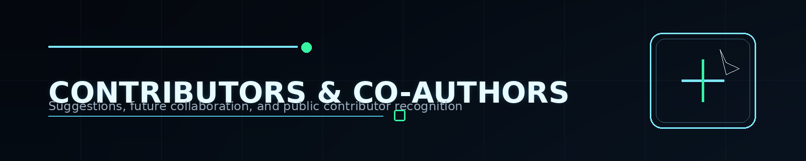

  

# Contributors and Co-Authors

This Knowledge Base is not being built as a closed vanity artifact.

It is being built as a **high-signal, practical Product Security system**, and strong outside input can make it better.

## What suggestions are welcome

High-value proposals can include:

- missing topics or domains;
- better structure and navigation;
- stronger examples or walkthroughs;
- practical corrections or clarifications;
- references that add real signal;
- ideas for labs, checklists, diagrams, or learning tracks.

## Recognition model

The intent is to **publicly recognize meaningful contributors**.

Depending on the level and consistency of contribution, recognition can include:

- mention in contributor acknowledgments;
- credit in relevant sections or releases;
- invitation into deeper editorial collaboration;
- future **co-author / contributing author** attribution for substantial work.

## What makes a strong contribution

The best suggestions are usually:

- practical;
- specific;
- respectful of the project's scope;
- grounded in real engineering or Product Security use;
- focused on improving clarity, accuracy, usefulness, or structure.

## How to contribute ideas

At this stage, the easiest paths are:

- open a GitHub issue or discussion once enabled;
- submit a structured suggestion through the repo workflow;
- join the beta track if you want to give deeper early feedback.

## Collaboration tone

This project values signal over noise.

That means thoughtful critique, concrete examples, better framing, better structure, and real-world usefulness matter more than vague “looks good” reactions.

## Related pages

- [Contributing](../CONTRIBUTING.md)
- [Beta Program](BETA-PROGRAM.md)
- [Roadmap](ROADMAP.md)
- [FAQ](FAQ.md)

  

---

  Contributors and Co-Authors • Product Security Knowledge Base • 2026

