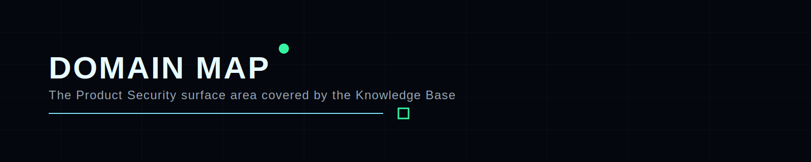

  

# Domain Map

The Knowledge Base is designed as a cross-linked Product Security system.

## Core domains

### 1) Product Security Leadership
Focus areas:

- governance and ownership models;
- roles, responsibilities, and operating boundaries;
- metrics, OKRs, and maturity framing;
- stakeholder communication and executive narrative.

### 2) Application Security
Focus areas:

- secure review workflows;
- web and service-layer assessment patterns;
- secrets hygiene;
- shift-left guardrails;
- secure implementation guidance.

### 3) DevSecOps
Focus areas:

- CI/CD controls;
- build integrity;
- policy gates;
- automation patterns;
- developer-friendly security integration.

### 4) API Security
Focus areas:

- authorization and identity boundaries;
- design review;
- abuse cases;
- validation, testing, and gateway-aligned controls.

### 5) Cloud Security
Focus areas:

- IAM;
- cloud baseline hardening;
- infrastructure-as-code review;
- platform trust boundaries;
- operational guardrails.

### 6) Container and Kubernetes Security
Focus areas:

- image trust;
- runtime posture;
- cluster hardening;
- workload isolation;
- practical platform review.

### 7) Threat Modeling
Focus areas:

- architectural reasoning;
- abuse-case mapping;
- control selection;
- security design tradeoffs.

### 8) Secure SDLC
Focus areas:

- integrating security into delivery;
- review checkpoints;
- evidence collection;
- practical workflows that engineering teams can actually use.

### 9) Learning, Mentoring, and Career Growth
Focus areas:

- newcomer ramp-up;
- labs and guided learning;
- interview readiness;
- hard-skill acceleration;
- practical industry navigation.

## Design principle

The important part is not just the number of topics.

The important part is that the Knowledge Base connects these domains **as one system** instead of presenting them as disconnected silos.

## Audience

This work is aimed at:

- security engineers;
- AppSec / DevSecOps practitioners;
- product and platform teams;
- architects and engineering leads;
- Product Security managers and future leaders;
- ambitious newcomers who want a better path than random internet noise.

## Related pages

- [Roadmap](ROADMAP.md)
- [FAQ](FAQ.md)
- [Prior Works](PRIOR-WORKS.md)

---

  Domain Map • Product Security Knowledge Base • 2026

