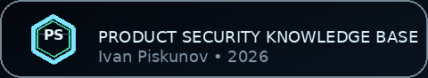

  

# Ecosystem Projects

This page highlights a curated set of public frameworks, reference systems, and industry initiatives that matter around **Product Security, Application Security, API Security, Cloud Security, DevSecOps, and Secure SDLC**.

> This is a **signal-first list**, not a ranked leaderboard. The goal is to point readers toward projects that are repeatedly useful in real Product Security work.

## Standout projects and reference systems

| Project | Why it matters |
|---|---|
| [OWASP ASVS](https://owasp.org/www-project-application-security-verification-standard/) | A practical verification standard for web applications and web services. Useful when you want engineering and AppSec teams to align on what “good” looks like beyond generic checklists. |
| [OWASP SAMM](https://owasp.org/www-project-samm/) | A mature software assurance framework for assessing and improving secure development programs. Strong fit for Product Security leaders who need an operating model, roadmap, and benchmark language. |
| [OWASP Top 10 (2025)](https://owasp.org/Top10/2025/) | Still the most recognizable awareness artifact in web application security. Best used as an entry point, not the whole program. |
| [OWASP API Security Project](https://owasp.org/www-project-api-security/) | A go-to reference for API-specific risks, control areas, and practical education. Especially useful for platform teams and teams building partner-facing services. |
| [OWASP DevSecOps Guideline](https://github.com/OWASP/DevSecOpsGuideline) | Helpful for turning “shift left” into actual pipeline practices, engineering controls, and implementation patterns. |
| [OpenSSF](https://openssf.org/) | One of the most important ecosystems around secure open source consumption, supply chain integrity, SBOMs, provenance, and project security baselines. |
| [SAFECode](https://safecode.org/) | A long-running nonprofit publishing high-signal guidance on secure development practices, software security programs, enablement, fuzzing, and Secure by Design. |
| [AWS Well-Architected Security Pillar](https://docs.aws.amazon.com/wellarchitected/latest/security-pillar/welcome.html) | A strong cloud-native reference for security design principles, workload reviews, and practical AWS-aligned architecture decisions. |
| [CloudSecDocs](https://cloudsecdocs.com/) | A hand-curated cloud and cloud-native security knowledge system by Marco Lancini. Great for fast signal on cloud, Kubernetes, DevSecOps, engineering culture, and leadership. |
| [Kubernetes Pod Security Standards](https://kubernetes.io/docs/concepts/security/pod-security-standards/) | A core reference for defining and enforcing baseline versus restricted workload behavior in Kubernetes environments. |

## How to use this page

- Start with **OWASP ASVS**, **OWASP SAMM**, and **SAFECode** if you are building or maturing a Product Security program.
- Add **OWASP API Security Project**, **AWS Security Pillar**, and **Kubernetes Pod Security Standards** when your scope includes modern platform and cloud-native environments.
- Use **OpenSSF** and the **OWASP DevSecOps Guideline** to strengthen supply chain thinking and CI/CD implementation patterns.
- Browse **CloudSecDocs** when you want a fast, well-curated jump-start across cloud, Kubernetes, and engineering leadership topics.

## Related pages

- [Domain Map](DOMAIN-MAP.md)
- [Voices to Follow](VOICES-TO-FOLLOW.md)
- [Reading List 2026](READING-LIST-2026.md)
- [Links](LINKS.md)

  

---

  Ecosystem Projects • Product Security Knowledge Base • 2026

