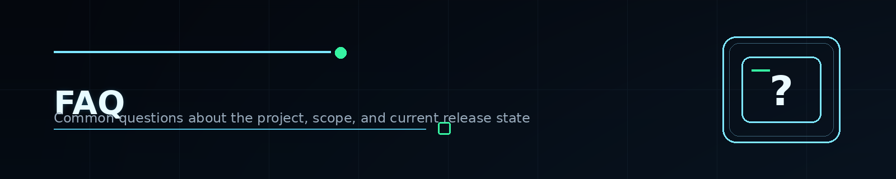

  

# FAQ

## Is this the full Knowledge Base?
No. This repository is the **promo / presentation repository** for the broader Product Security Knowledge Base.

## Where is the alpha version?
The public alpha currently lives on GitBook:
[Product Security Knowledge Base — GitBook alpha](https://ivan-piskunov-or-cybersecurity.gitbook.io/product-security/t9N8rJShNrBINAUnDiHq)

## Who is this for?
Security engineers, AppSec and DevSecOps practitioners, platform teams, architects, Product Security leaders, and ambitious learners.

## Is this only about AppSec?
No. AppSec is a major part of the work, but the broader project covers Product Security as a system — including Cloud, API, platform, Secure SDLC, threat modeling, mentoring, and leadership framing.

## Why a separate promo repo?
Because a strong public-facing GitHub entry point is useful on its own:
it explains the mission, highlights the roots, creates a clean narrative, and helps people quickly understand why the project exists.

## Is feedback welcome?
Yes — especially from thoughtful beta readers and practitioners.

## Can contributors be recognized publicly?
Yes. Strong contributors, editorial helpers, and future authors can be recognized on the project as **contributors / co-authors**.
See: [Contributors and Co-Authors](CONTRIBUTORS-AND-COAUTHORS.md)

## Related pages

- [Beta Program](BETA-PROGRAM.md)
- [Contributors and Co-Authors](CONTRIBUTORS-AND-COAUTHORS.md)
- [Links](LINKS.md)
- [About the Author](ABOUT-THE-AUTHOR.md)

  

---

  FAQ • Product Security Knowledge Base • 2026

