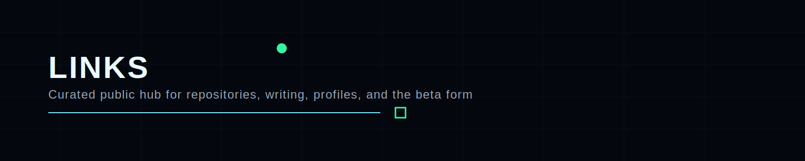

  

# Links

## Main hub

- GitHub profile: <https://github.com/D3One>
- Product Security GitBook alpha: <https://ivan-piskunov-or-cybersecurity.gitbook.io/product-security/t9N8rJShNrBINAUnDiHq>

## Public project roots

- DevSecOps Notes Box: <https://github.com/D3One/DevSecOps-Notes-Box>
- White2Hack: <https://github.com/D3One/White2Hack>
- K8-Shield: <https://github.com/D3One/K8-Shield>
- Product-Security-Manager: <https://github.com/D3One/Product-Security-Manager>
- Docs_DevSecOps_Vault: <https://github.com/D3One/Docs_DevSecOps_Vault>
- ivanpiskunov repo: <https://github.com/D3One/ivanpiskunov>

## Public writing

- DEV profile: <https://dev.to/d3one>
- Medium profile: <https://medium.com/@ivanpiskunov>
- Hacker author page: <https://xakep.ru/author/g14vano/>
- Product Security announcement article:
  <https://dev.to/d3one/i-built-a-product-security-knowledge-base-a-public-reference-system-for-engineers-architects-474c-temp-slug-3799334?preview=84a8ab3a167720b94b99032fb219103905ff3616c79ef62f8015bad469001c9ca6c90fe605d8ff6d30e9bae7359d9bfe8c0ba0a417fb1c4d0d5803bc>

## Long-form material

- Kubernetes Security book: <https://ivan14piskunov.gumroad.com/l/k8security>

## Bio / profile context

- SlimWiki: <https://slimwiki.com/ivanpiskunov/ivanpiskunov/ivan-piskunov-28m8m4x2c7-4fbedzamepy7>

## Beta program

- Beta intake form: <https://forms.gle/GXSK8aDogTQ46Kgv6>

---

  Links • Product Security Knowledge Base • 2026

