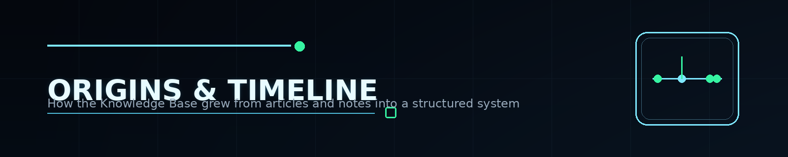

  

# Origins and Timeline

This Knowledge Base is the result of a long-running progression rather than a single launch.

## Phase 1 — Public writing

The earliest layer was public writing: technical articles, explainers, notes, and practical security content.  
That created the habit of **collecting, filtering, and explaining** information instead of just consuming it.

## Phase 2 — Structured long-form material

The next layer was longer-form educational material: books, note collections, practical cheat sheets, and reference-style content.

This is where the work started to move from **articles** into **systems**.

## Phase 3 — Community and audience

A parallel stream was community publishing — especially through Telegram and public writing platforms.

That helped validate what people actually needed:

- practical guidance;
- fewer buzzwords;
- more structure;
- more engineering reality;
- more signal for career growth and interviews.

## Phase 4 — Reusable reference assets

From there, multiple public repositories and materials emerged:

- notes and e-books;
- utility repositories;
- vault-style collections of guides and checklists;
- Product Security framing documents;
- article collections and public author pages.

## Phase 5 — Product Security convergence

Over time, the center of gravity moved from isolated security topics toward a broader **Product Security** perspective.

Instead of treating AppSec, DevSecOps, Cloud Security, API Security, Secure SDLC, and leadership enablement as separate islands, the Knowledge Base treats them as part of one operating surface.

## Phase 6 — Knowledge Base

The final step is the Product Security Knowledge Base itself:

- a curated reference system;
- a structured learning and execution environment;
- a platform for engineering enablement;
- a public-facing proof of direction and long-term depth.

## Timeline snapshot

| Stage | What was built |
|---|---|
| Early public publishing | technical articles, notes, practical observations |
| Community phase | Telegram publishing, audience building, topic curation |
| Educational layer | books, e-books, walkthroughs, long-form materials |
| Engineering utility layer | scripts, tools, checklists, repo-based references |
| Product Security layer | leadership framing, strategy, governance, maturity |
| Knowledge Base layer | domain-organized, presentation-aware, reusable reference system |

## Why the timeline matters

This project is not just a document set.

It is evidence of a continuing pattern:

**observe → distill → systematize → teach → refine → scale**

That pattern is the real foundation of the Product Security Knowledge Base.

## Related pages

- [Prior Works and Public Trail](PRIOR-WORKS.md)
- [About the Author](ABOUT-THE-AUTHOR.md)
- [Roadmap](ROADMAP.md)

  

---

  Origins and Timeline • Product Security Knowledge Base • 2026

