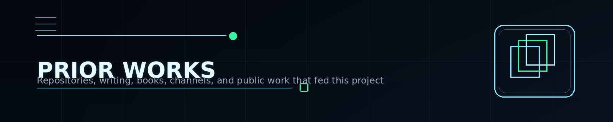

  

# Prior Works and Public Trail

This page maps the public works that helped shape the Knowledge Base before it became a dedicated Product Security reference system.

## Foundational repositories and project roots

| Work | Why it matters |
|---|---|
| [D3One GitHub Profile](https://github.com/D3One) | public profile hub connecting projects, focus areas, and featured work |
| [DevSecOps Notes Box](https://github.com/D3One/DevSecOps-Notes-Box) | practical notes, code samples, security guidance, and long-form technical reference material |
| [White2Hack](https://github.com/D3One/White2Hack) | community publishing lane and long-running cybersecurity content ecosystem |
| [K8-Shield](https://github.com/D3One/K8-Shield) | Kubernetes-oriented security utility / audit direction |
| [Product-Security-Manager](https://github.com/D3One/Product-Security-Manager) | Product Security framing, leadership thinking, and role definition |
| [Docs_DevSecOps_Vault](https://github.com/D3One/Docs_DevSecOps_Vault) | reusable documents, vendor-aligned references, scripts, checklists, and patterns |
| [ivanpiskunov repo](https://github.com/D3One/ivanpiskunov) | achievements, biography-oriented links, and public proof-of-work context |

## Career, narrative, and author pages

| Link | Description |
|---|---|
| [SlimWiki profile](https://slimwiki.com/ivanpiskunov/ivanpiskunov/ivan-piskunov-28m8m4x2c7-4fbedzamepy7) | broader narrative and background page |
| [DEV profile](https://dev.to/d3one) | public Product Security / DevSecOps / leadership articles |
| [Medium profile](https://medium.com/@ivanpiskunov) | earlier writing and technical article stream |
| [Hacker author page](https://xakep.ru/author/g14vano/) | archive of technical publications and historical writing trail |

## Public articles that helped shape the direction

### Technical / engineering roots

- [Bulletproof Kubernetes / Kubernetes hardening article](https://xakep.ru/2019/08/28/bulletproof-kubernetes/)
- [Docker security article](https://xakep.ru/2019/07/05/docker-security/)

### Product Security and leadership evolution

- [Global Product Security Strategy: A Multi-Layered Framework](https://dev.to/d3one/global-product-security-strategy-a-multi-layered-framework-ip-developed-cb1)
- [Boosting Security Excellence: How OKRs Drive Results in Application Security and DevSecOps](https://dev.to/d3one)
- [CISO 101: What the Terms Mean—and How to Use Them With the Business](https://dev.to/d3one)

### Career / narrative context

- [15-Year Cybersecurity Career Journey: from newbie to CISO and Startup Owner](https://dev.to/d3one/15-year-cybersecurity-career-journey-from-newbie-to-ciso-and-startup-owner-2f4l)

## Books and long-form materials

| Resource | Description |
|---|---|
| [Kubernetes Security book on Gumroad](https://ivan14piskunov.gumroad.com/l/k8security) | long-form Kubernetes security material |
| [DevSecOps Notes Box](https://github.com/D3One/DevSecOps-Notes-Box) | self-published note-book / practical guide |
| [Product Security GitBook alpha](https://ivan-piskunov-or-cybersecurity.gitbook.io/product-security/t9N8rJShNrBINAUnDiHq) | the current alpha / pre-release structured KB |

## Community ecosystem

| Resource | Role |
|---|---|
| [White2Hack Telegram ecosystem](https://github.com/D3One/White2Hack) | broad cybersecurity publishing and community lane |
| CyberSecBastion | Product Security–oriented focused side lane in the broader ecosystem |
| DevOps School Moscow | educational contribution where Ivan taught a security-focused part of the program |
| GitBook alpha readers | early structured audience for the KB format |
| Beta reader group | pre-release quality feedback loop |

## Why these links matter

They show that the Knowledge Base is not starting from zero.

It is built on:

- years of public writing;
- repository-based knowledge packaging;
- educational material;
- security tooling and operational notes;
- community contribution;
- Product Security leadership framing.

## Related pages

- [Origins and Timeline](ORIGINS-AND-TIMELINE.md)
- [Contributors and Co-Authors](CONTRIBUTORS-AND-COAUTHORS.md)
- [Beta Program](BETA-PROGRAM.md)
- [Links](LINKS.md)

  

---

  Prior Works and Public Trail • Product Security Knowledge Base • 2026

