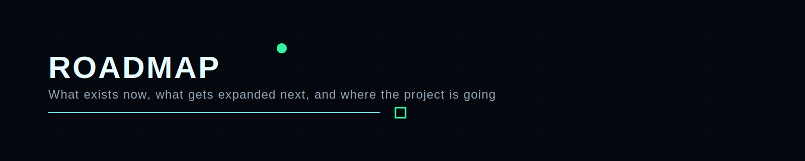

  

# Roadmap

## Current state

- public promo repository;
- GitBook alpha / pre-release;
- curated roots already visible through articles, books, community, and supporting repositories;
- early beta-reader intake.

## Next milestones

### 1) Structure hardening
Improve navigation, reduce overlap, and make the entry paths clearer for different audiences.

### 2) Content normalization
Align terminology, style, quality level, and section rhythm across domains.

### 3) Diagram and workflow expansion
Add more visual explanation layers for architecture, controls, and process patterns.

### 4) Leadership layer expansion
Continue building material for Product Security management, strategy, metrics, and operating models.

### 5) Reader feedback integration
Use beta input to refine what deserves more depth, less noise, or better navigation.

### 6) Public release maturity
Move from alpha / pre-release presentation into a more stable public release state.

## Long-term direction

The long-term direction is to make this project a dependable Product Security reference environment that helps both:

- practitioners doing the work;
- leaders shaping the function.

## Related pages

- [Domain Map](DOMAIN-MAP.md)
- [FAQ](FAQ.md)
- [Beta Program](BETA-PROGRAM.md)

---

  Roadmap • Product Security Knowledge Base • 2026

